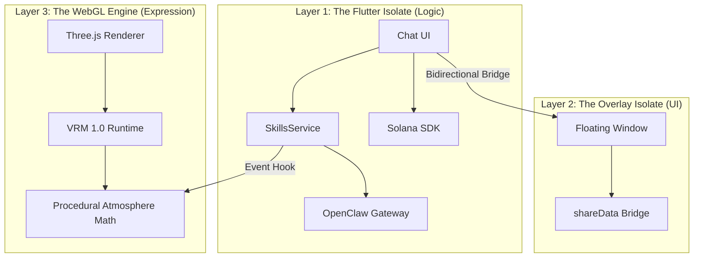

# 🌌 OpenClaw: The AI-Native Wearable Interface

<div align="center">
  
  
  <br/>
  
  **🤖️ Your Pocket AGI Companion**  
  **🔗 Native Solana Web3 Logic • 🎭 Airi-Style Procedural VRM • 📱 Android Transparent Overlay**
  
  <br/>
  
  [](https://opensource.org/licenses/MIT)
  [](https://flutter.dev)
  [](https://nodejs.org)
  [](https://solana.com)
</div>

---

## 📋 **Executive Summary**

**OpenClaw** is a next-generation AI agent platform that transforms your Android device into a 24/7 autonomous digital being. By bridging the gap between high-performance local LLM logic (**OpenClaw Gateway**) and hyper-realistic 3D expression (**AgentVRM**), we have created the world's most advanced "Wearable Interface" for your phone.

Whether checking the weather, managing your **Solana** portfolio, or executing complex multi-step "Skills," your OpenClaw companion lives on your home screen—breathing, thinking, and reacting in real-time.

---

## ✨ **The "Airi-Style" Edge: AgentVRM**

In 2026, a chat box isn't enough. OpenClaw features a **World-Class 3D Rendering Pipeline** inspired by Project Airi and Neuro-sama.

### 🎭 **Procedural Realism Matrix**
Our avatars don't just "loop" animations. They are driven by a **Layered Procedural Matrix** in Three.js:
- **🌬️ Ambient World Engine:** Procedural wind force injected into VRM Spring Bones. Hair and clothing ripple naturally even when idle.
- **👁️ Saccadic Gaze & Focus:** Independent neck and eye-tracking using sum-of-sines pseudo-noise for an "alive" look.
- **🎙️ Isolate-Driven Lip Sync:** Bidirectional bridge between the Flutter TTS engine and the WebGL renderer for flawlessly smooth background lip-sync.
- **🧠 Skill Reactions:** The avatar physically reacts to OpenClaw events (e.g., striking a `pose` when calculating or `ready` after execution).

### 🌌 **Transparent Floating Overlay**
Escape the app. OpenClaw utilizes a custom **System Alert Window Overlay**, allowing your 3D companion to float over any Android application with true glassmorphic transparency. Talk to your agent locally while using Twitter, Discord, or your favorite games.

---

## 🏗️ **Architecture & Tech Stack**

### **The Multi-Isolate Engine**
OpenClaw is surgically optimized for mobile efficiency using a 3-layer architecture:



### **⚡ Core Technology**
- **Frontend**: Flutter (Dart) with `flutter_overlay_window`.
- **3D Graphics**: [Three.js](https://threejs.org/) + [@pixiv/three-vrm](https://github.com/pixiv/three-vrm).
- **Backend**: Node.js local gateway running in a sandboxed Android Proot environment.
- **Web3**: Native Solana Wallet integration (Jupiter Ultra API, DCA, Limit Orders).
- **Voice**: [Piper TTS](https://github.com/rhasspy/piper) (On-device neural voice) + Google STT.

---

## 🚀 **Installation & Setup**

### **Prerequisites**
- **Android SDK**: API 21+ (Android 5.0+)
- **Flutter SDK**: 3.24 or higher
- **Node.js**: 20.0+

### **📦 Deployment**
```bash
# 1. Clone & Install Flutter dependencies
git clone https://github.com/vmbbz/plawie.git
cd openclaw_final
flutter pub get

# 2. Setup local AI Gateway
cd android/app/src/main/assets/nodejs-project
npm install

# 3. Launch App
flutter run --release
```

---

## 🤖 **Using Your Agent**

### **Voice Interaction**
- **Overlay Mic**: Tap the floating mic button on your home screen to talk to the agent in the background.
- **Keyword Triggers**: "Hey Clawa", "Open search", "Check SOL balance".

### **Solana Operations**
OpenClaw turns complex DeFi into a conversation:
- *"Swap 0.5 SOL for USDC"*
- *"Set a limit order for BONK at $0.00002"*
- *"Show me my portfolio value"*

---

## 🏆 **Development Roadmap**

### **Phase 1-3: Foundation & Web3** ✅
- [x] Local Proot Node.js Gateway.
- [x] Native Solana wallet & Jupiter integration.
- [x] 35+ Local Android Skills.

### **Phase 4-6: AgentVRM & Realism** ✅
- [x] **Procedural Animation Matrix** (Airi-style logic).
- [x] **Transparent Background Overlay**.
- [x] **Ambient World Engine** (Procedural wind physics).
- [x] **Skill-to-Gesture Bus**.

### **Phase 7: The Collective (Future)** 🔮
- [ ] Multi-agent collaborative swarms.
- [ ] Advanced "Wearable" hardware integration.
- [ ] On-chain Avatar evolution (NFT metadata sync).

---

## 🤝 **Contributing**
We are building the **"Linux for AI Companions."** We welcome PRs for:
- Optimized WebGL Shaders.
- New `.vrma` gesture packs.
- Advanced Solana automation "Skills."

Please see [CONTRIBUTING.md](CONTRIBUTING.md) for style guides and isolate communication standards.

---

## 📄 **License & Legal**
This project is licensed under the **MIT License**. Distributed as-is for educational and experimental automation purposes.

---

<div align="center">
  <strong>🌌 OpenClaw - Your AI Agent, Your Rules, Your Reality 🌌</strong>  
  <em>Bridging Logic and Expression on your home screen.</em>
</div>
